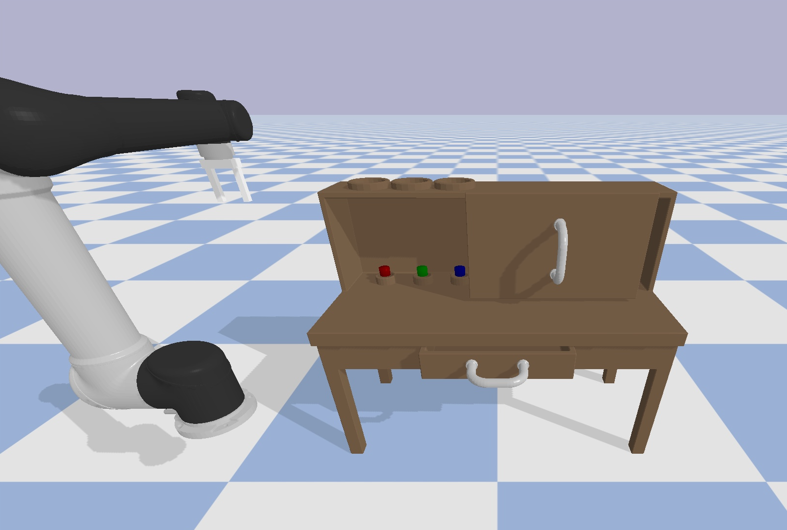

# playroom_pybullet

robotic desk environment with UR5 robot arm and custom 2-finger gripper (Mujoco style)




based on [playrooms](https://github.com/google-research/google-research/tree/master/playrooms)

## Run

Test Desk:

```python3 test_world.py```


Test Desk + arm:

```python3 test_env.py```
